# Lab 00: Oracle Cloud Infrastructureのトライアルアカウントを作成する

## 学べること

- トライアルアカウントの作成方法

## 概要

Oracle Cloud Infrastructure(OCI)のトライアルアカウントにサインアップして、MySQL Database ServiceやHeatWaveなどのクラウドサービスを試すことができます。30日間300米ドルの無料クレジットが付与されます。無料クレジットをすべて使い切るか、30日が経過すると、トライアルアカウントはFreeTier(無償)に移行されます。

## 手順

### **Step - 1:** Oracle Cloud Infrastructureに登録する

**参考動画(英語)**: https://www.linkedin.com/feed/update/urn:li:activity:6724226562507595776/
Oracle Cloud Free Tier Accountに登録する際には **[Oracle Cloud Free Tier webページ](https://www.oracle.com/jp/cloud/free/)** にアクセスし、**無料で始める** をクリックしてください  
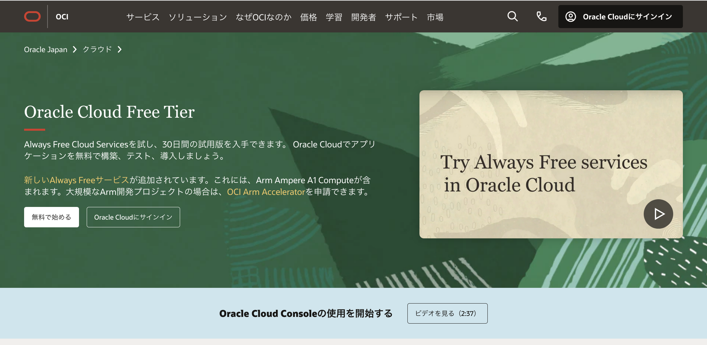
 
**[Oracle Cloud Free Tierよくある質問](https://www.oracle.com/jp/cloud/free/faq.html)**  

### **Step 2:**
アカウント作成時には、名前、メールアドレス、国を入力後に使用条件を確認し、**Verify my email** をクリックします。 
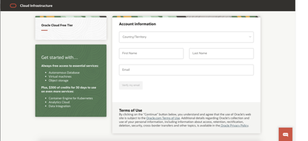
 
検証後、入力したメールアドレスにOracleよりアカウント確認メールが送信されますので、メールに記載されているURLにアクセスして登録を続けます。 
なお、既にOCIに登録されているアカウントに関連づけられたメールアドレスは登録できない可能性があります。
 
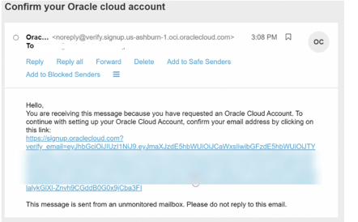
 

### **Step 3:**
以下の情報を入力して、Oracle Cloud FreeTierアカウントを作成します。
- Password: アカウントパスワードを決めて下さい。
- Company Name: 会社名を入力してください。
- Cloud Account Name: クラウドアカウント名は入力に基づいて自動的に生成されます。新しい値を入力することでその名前を変更できます。入力した内容を控えておいてください。後でサインインするときにこの名前が必要になります。
- Home Region: OCIのホームリージョンを選択します。サインアップすると、ホームリージョンを変更することはできません。
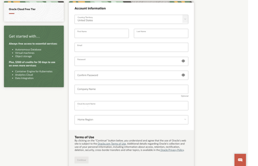
 

引き続き、Address information(住所情報)を入力し、_**[Continue]**_ をクリックします。
 
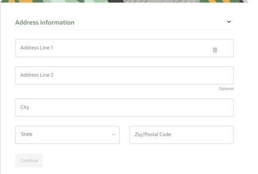
 

入力できたら _**[Continue]**_ をクリックし、引き続き国の選択と携帯電話番号を入力します。 
入力できたら _**[Text me a code]**_ をクリックします。 
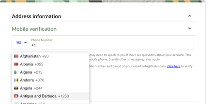
 
コードを受け取ったらコードを入力して_**[Verify My Code]**_ をクリックします。
 
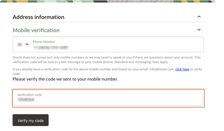
 

### **Step 4:**
_**[Add payment verification method(支払い確認方法の追加)]**_ ボタンをクリックします。 
_**これは無料のアカウントです。アカウントのアップグレードを選択しない限り、請求は発生しません。**_ 
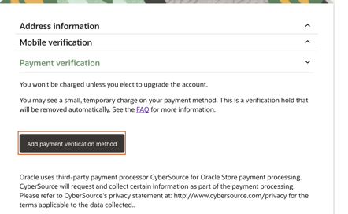
 

 
お支払い方法の設定が完了したらチェックボックスをクリックして、契約を確認して同意します。 
_**[Start my free trial]**_ボタンをクリックします。 
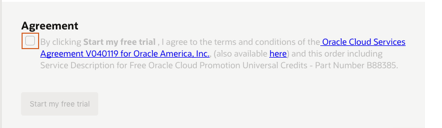
 

### **Step 5:**
アカウントが利用できるようになると、自動的にサインインページに移動します。また、Oracleから2通の電子メールを送信されます。 
1通の電子メールがプロビジョニングが進行中であることの最初の通知になります。もう1つの電子メールは、プロビジョニングが完了したことを通知するものです。 
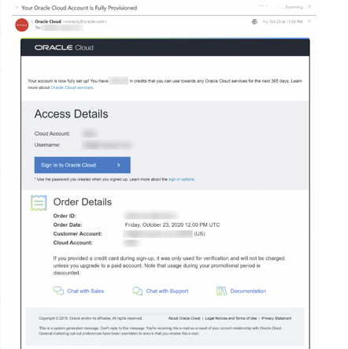
 

### **Step 6:**
クラウドアカウント名を入力し、_**[Next]**_ をクリックします。これは、前のセクションでアカウントを作成するときに選択した名前です。(メールアドレスではありません) 
アカウント名が不明の場合は、確認メールをご覧ください。 
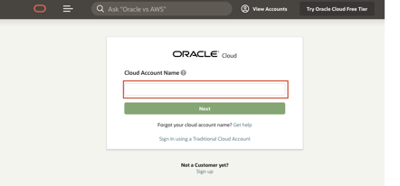
 

### **Step 7:**
クラウドアカウントの資格情報を入力し、_**[Sign In]**_ をクリックします。ユーザー名はメールアドレスになります。パスワードは、アカウントにサインアップしたときに設定したものです。 
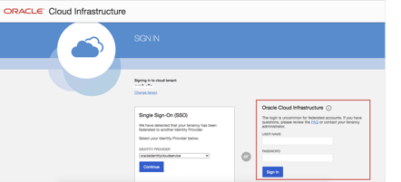
 

### **Step 8:**
これで、Oracle Cloudにサインインできました！
 
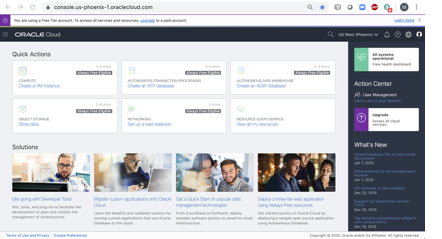
 

### **Step 9**
OCIコンソールの基本的な操作、コンパートメントの作成方法については **OCIチュートリアル (https://oracle-japan.github.io/ocitutorials/beginners/getting-started/)** をご参照ください。  

 

## まとめ

ここまでの操作でトライアルアカウントを作成できました。コンパートメントの作成ができたら次の演習に進みましょう！

**[Home](../README.md)** | **[Lab 01 >>](../Lab01/README.md)**
