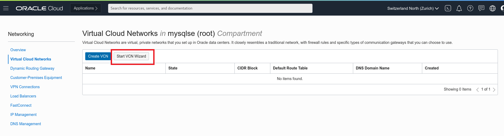

# Lab 01: 仮想ネットワークを作成し、MySQL Database Serviceポートへの接続を確立する

## 学べること

- インターネット接続を持つ仮想ネットワーク(VCN)の作成方法
- セキュリティリストにイングレスルールを追加してMySQL Database Serviceポートへの接続を確立する

## 概要

VCNは、サブネット、ルートテーブル、セキュリティリスト、ゲートウェイなどを定義することにより、OracleCloud内で独自のデータセンターネットワークトポロジを設定することができます。これらのコンポーネントの一部は、すべてのVCN内でデフォルトで自動的に設定され削除することはできません。
•	ルート・ルールのないデフォルトのルート表
•	デフォルトのセキュリティ・ルールが設定されたデフォルトのセキュリティリスト
•	デフォルト値のあるDHCPオプションのデフォルト・セット
VCNの概要、許容サイズ、デフォルトのVCN、およびVCNを使用するためのシナリオについては **[ネットワークの概要](https://docs.oracle.com/en-us/iaas/Content/Network/Concepts/overview.htm#network_landing)** を確認してください。

セキュリティリストは、インスタンスの仮想ファイアウォールとして機能し、出入りを許可するトラフィックのタイプを指定するイングレスルールとエグレスルールを備えています。各サブネットには複数のセキュリティリストを関連付けることができ、各リストには複数のルールを含めることができます。デフォルトのセキュリティリストには、ステートフル・ルールの初期セットが付属しています。ほとんどの場合、そのVCNまたはサブネットをホストするリージョンに関連する許可されたサブネットからのインバウンドトラフィックのみを許可するように変更する必要があります。各リージョンに関連する許可されたサブネット範囲のリストは、**[こちら](https://docs.cloud.oracle.com/iaas/tools/public_ip_ranges.json)** にあります。

## このステップの構成図

## 手順

### **Step 1.1:**
  OCIテナンシにログインし、画面左上の　_**メニュー**_　から　_**ネットワーキング >> 仮想クラウド・ネットワーク**_ を選択します。

### **Step 1.2:**
 画面左下のコンパートメント一覧から利用するコンパートメントを選択します。

### **Step 1.3:** 
 仮想クラウド・ネットワークを作成するために _**VCNウィザードの起動**_ をクリックします。 

### **Step 1.4:** 
 _**インターネット接続性を持つVCNの作成**_ を選択して _**VCNウィザードの起動**_　をクリックします。

### **Step 1.5:**
 VCNに必要な情報をいくつか設定します。_**VCN名**_ には _**analytics_vcn_test**_ (もしくは任意の名前)を入力し、正しいコンパートメントが選択されていることを確認します。その他の項目はデフォルトのまま設定し、_**次**_ をクリックします。

### **Step 1.6:** 
 入力内容を確認し、_**作成**_　をクリックします。

### **Step 1.7:** 
 VCNの作成が完了したら _**仮想クラウド・ネットワークの表示**_　をクリックします。

### **Step 1.8:** 
 _**パブリック・サブネット-analytics_vcn_test**_ のリンクをクリックします。

### **Step 1.9:** 
 VCNウィザードでデフォルトのセキュリティリストを使用するようにサブネットを設定しました。このリストには、Oracle Cloudの使用を簡単に開始できるようにデフォルトのルールが設計されています。
 次に、VCNのデフォルトのセキュリティリストをカスタマイズして、_**Default_Security_List_for_analytics_vcn_test**_　をクリックしてMySQLデータベースのポートを通過するトラフィックを許可します。  

### **Step 1.10:** 
  _**イングレス・ルールの追加**_　をクリックします。

### **Step 1.11:**
 必要なルールをデフォルトのセキュリティリストに追加して、MySQLデータベースサービスポートを介したトラフィックを有効にします。

設定する値は以下の通りです:
ソースCIDR  _**0.0.0.0/0**_,  宛先ポート範囲 _**3306**_, 説明  _**MySQL Port**_

入力したら _**イングレス・ルールの追加**_　をクリックします。

## まとめ

ここまでの操作でVCNを作成し、セキュリティ・リストにイングレス・ルールが追加できました。次のトピックに進みましょう！

VCNとサブネットについては **[VCNとサブネットの概要](https://docs.oracle.com/ja-jp/iaas/Content/Network/Tasks/managingVCNs_topic-Overview_of_VCNs_and_Subnets.htm)**　を参照してください。

**[Home](../README.md)** | **[Lab 02 >>](../Lab02/README.md)**
