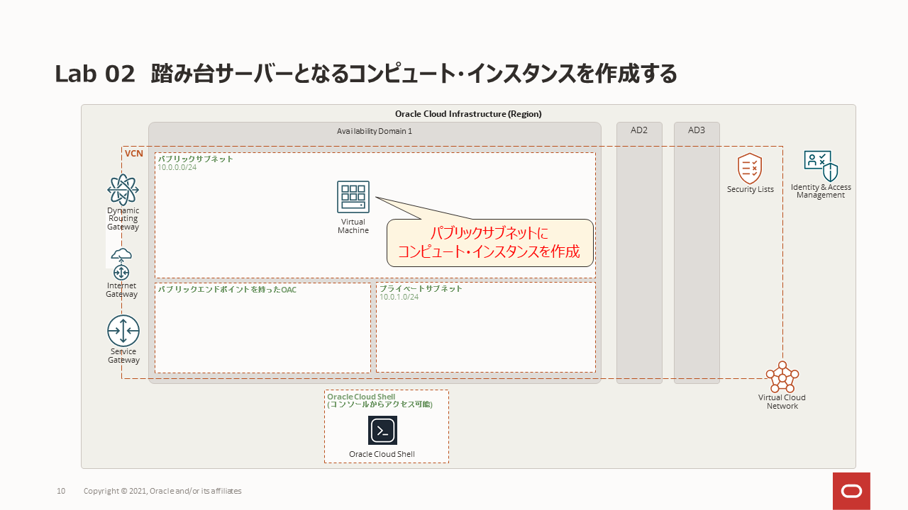
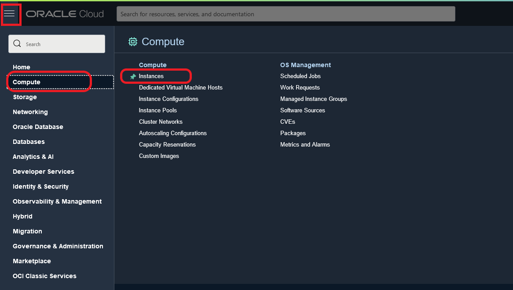
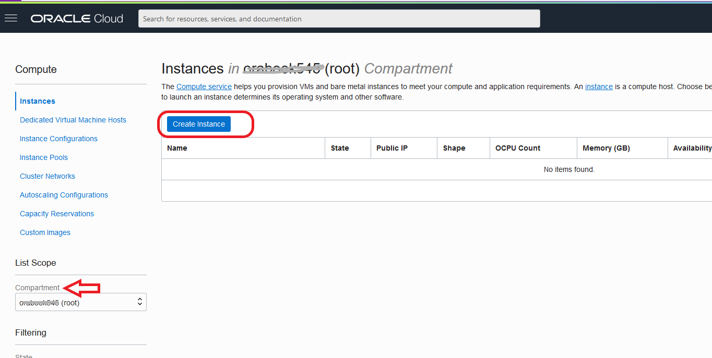
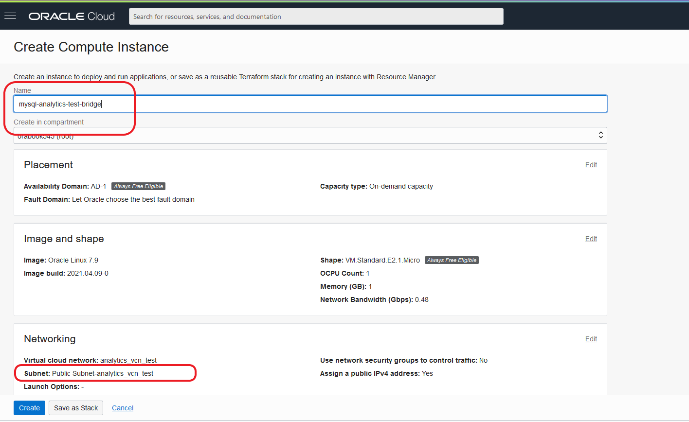
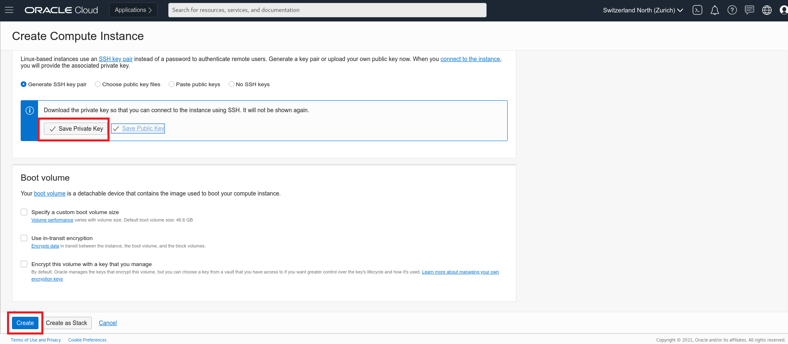
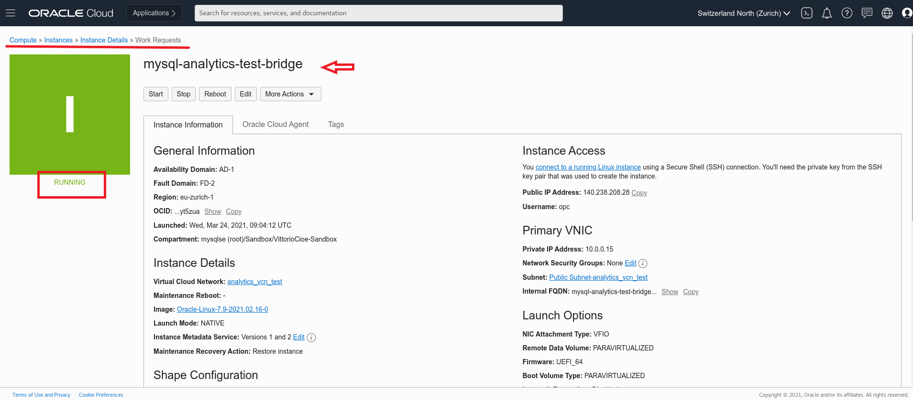

# Lab 02:踏み台サーバーとなるコンピュート・インスタンスを作成する

## 学べること

- 特定のコンパートメントにコンピュート・インスタンスを作成する方法 

## 概要

踏み台サーバーは、インターネットなどの外部ネットワークからプライベートネットワークにアクセスするためのパブリック・エントリポイントとして機能するコンピュート・インスタンスです。 プライベートネットワークにアクセスするには、トラフィックが踏み台サーバーを通過する必要があります。セキュリティ設定を行うことで、トラフィックを処理できます。

詳細についてはホワイトペーパーをご参照ください: **[仮想クラウド・ネットワークのための保護アクセス](https://docs.oracle.com/cd/F34086_01/bastion-hosts_jp.pdf)**. 

## このステップの構成図

## 手順

### **Step 2.1:**
- 画面左上のメニューから _**コンピュート >> インスタンス**_ を選択します。
  

### **Step 2.2:** 
- 画面左下のコンパートメント一覧からVCNを作成した際に選択コンパートメントと同じコンパートメントを選択します。_**インスタンスの作成**_ をクリックします。

### **Step 2.3:** 
- _**名前**_ に _**mysql-analytics-test-bridge**_ (もしくは任意の名前)を入力します。 この名前は内部のFQDNとして使用されます。
  _**配置**_ および _**イメージとシェイプ**_ セクションではアベイラビリティ・ドメイン、フォルト・ドメイン、使用するイメージ、シェイプを設定することができます。ここでは、デフォルトの設定で進めます。

- ネットワーキングでは、 作成したVCNが選択されていることを確認し、パブリック・サブネット(_**パブリック・サブネット - analytics_vcn_test**_) をドロップダウンメニューから選択します。
  

### **Step 2.4:** 
- 画面下にスクロールすると秘密キーを保存するか確認するセクションがあります。 
この秘密キーは後でコンピュート・インスタンスに接続する際に必要になります。
秘密キーを保存し、_**作成**_ をクリックします。

### **Step 2.5:** 
- コンピュート・インスタンスが起動すると、アイコンが緑色に変わります。
 インスタンスが起動するまで、次の演習を実施することができます。

## まとめ

このLabでは、前のLabで作成したVCNへのパブリック・エントリポイントであるBastionホストとして機能するコンピュート・インスタンスを作成しました。また、ローカルデバイスに秘密キーを保存して、コンピューティングインスタンスに接続できるようにしました。次に、Heatwaveを利用するMySQLデータベースサービス（MDS）をデプロイしましょう！

コンピュート・インスタンスについては **[Computeサービスの概要](https://docs.oracle.com/ja-jp/iaas/Content/Compute/Concepts/computeoverview.htm)** を参照ください。

 **[<< Lab 01](/Lab01/README.md)** | **[Home](../README.md)** | **[Lab 03 >>](/Lab03/README.md)**
