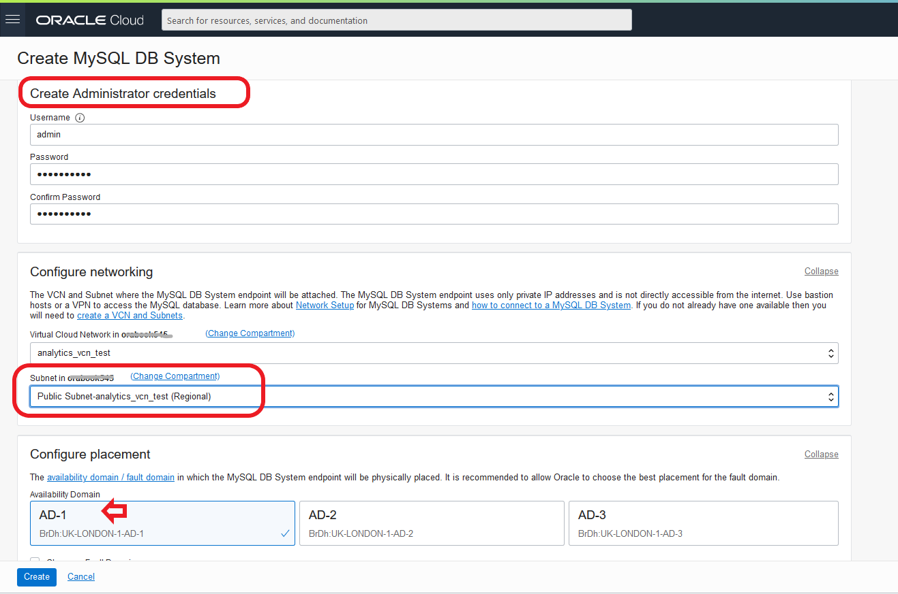

# Lab 03: MySQL DB System (MDS) および Heatwaveをデプロイする 

## 学べること
- MySQL Database Service および Heatwaveをデプロイし、設定する方法
- 管理者の作成方法

## 概要

HeatWaveを有効にすると、HeatWaveのシェイプ（MySQL.HeatWave.VM.Standard.E3）と1TBのデータストレージを特徴とするスタンドアロンDBシステムをデプロイします。 DBシステムとHeatWaveクラスターは同じシェイプを使用する必要があります。詳細は **[HeatWave](https://docs.oracle.com/ja-jp/iaas/mysql-database/doc/heatwave1.html#GUID-9401C69A-B379-48EB-B96C-56462C23E4FD)** を参照してください。

## このステップの構成図


## 手順

### **Step 3.1:**
- 画面左上のメニューから _**データベース >> DBシステム**_ を選択します。
  


### **Step 3.2:**
- 前の手順で、DBシステムの作成画面に移動します。
　左側のコンパートメントが、VCNとコンピュート・インスタンスの作成時に選択したものと同じコンパートメントを選択していることを確認します。確認できたら _**DBシステムの作成**_ をクリックします。


### **Step 3.3:**
- DBシステムの作成を開始します。 コンパートメントを再度チェックし、名前に _**mysql-analytics-test**_ という名前を入力し、[HeatWave]を選択します。 これにより、HeatWave対応のMDSインスタンスを作成できます。 今回は他のチェックボックスは無視してください。
  


### **Step 3.4:**
- _**管理者資格証明の作成**_ セクションでは以下を入力します:
```
ユーザー名: admin
パスワード: Oracle.123
```
- _**ネットワーキングの構成**_ セクションでは、コンピュート・インスタンス作成時に指定したサブネットと同じになっているか確認します(Public-Subnet-analytics_vcn_test)。

- アベイラビリティ・ドメインはデフォルトのままとし、_**ハードウェアの構成**_ セクションに進みます。

  

### **Step 3.5:**
- _**ハードウェアの構成**_ セクションで、シェイプ: MySQL.HeatWave.VM.Standard.E3, CPUコア数: 16, メモリー・サイズ: 512 GB, データ・ストレージ・サイズ: 1024と設定されていることを確認します。</br>
_**バックアップ・プランの構成**_ セクションはデフォルトのままバックアップ保持期間を7日間としておきます。


### **Step 3.6:**
- 画面下部にスクロールし、_**拡張オプションの表示**_ リンクをクリックします。
  


### **Step 3.7:**
- 構成タブで _**構成の選択**_ をクリックします。 


### **Step 3.8:**
- _**構成の参照**_ 画面で、MySQL.HeatWave.VM.Standard.E3.Standaloneを選択し、_**構成の選択**_ をクリックします。 


### **Step 3.9:**
- 正しく選択できていれば、以下のような画面表示になります。


### **Step 3.10:**
- ネットワーキングタブに移動し、ホスト名に _**mysql-analytics-test**_ (DBシステム名と同じ名前)を入力します。 
ポートの設定が以下となっていることを確認します。</br>
MySQLポート: 3306</br>
MySQL X プロトコル・ポート: 33060</br>
確認できたら _**作成**_ をクリックします。


### **Step 3.11:**
- MDSは _**作成中**_ の状態になります(下記画面例)。 起動まで少し時間がかかるので、次の演習に進んでいただいて大丈夫です。
  


## まとめ

ここまでの操作でMySQL Database Service および HeatWave をデプロイし、データベース管理者を作成しました。 次に、MySQL Shellをインストールしましょう!

詳細は **[DBシステムの作成](https://docs.oracle.com/ja-jp/iaas/mysql-database/doc/creating-db-system1.html)** を参照してください。

**[<< Lab 02](/Lab02/README.md)** | **[Home](../README.md)** | **[Lab 04 >>](/Lab04/README.md)**
