# Lab 04: 踏み台サーバーにMySQL Shellをインストール、サンプルデータのダウンロード

## 学べること
- OCI Cloud Shellと踏み台サーバーへの接続方法
- MySQL Shellの起動方法
- サンプルデータのダウンロード、およびセットアップ
  
## 概要

Oracle Cloud Infrastructure (OCI) Cloud Shellは、OCIコンソールからアクセスしBashシェルを実行する小さな仮想マシンです。 Cloud Shellには、テナンシーのホームリージョンに設定された事前認証済みのOCI CLIと、最新のツールおよびユーティリティが付属しています。Cloud Shellには、ホームディレクトリ用に5GBの永続ストレージが付属しているため、ホーム・ディレクトリにローカルで変更を加えた後、クラウド・シェルに戻ったときにプロジェクトで作業を続行できます。クラウド・シェルは(月次テナンシ制限内で)無償で使用でき、クラウド・シェルへのアクセス権を付与するIAMポリシー以外の設定または前提条件が必要ありません。クラウド・シェルには、それ自体のテナンシで実行されるVMがプロビジョニングされています(テナンシのリソースが使用されないため)。

## このステップの構成図
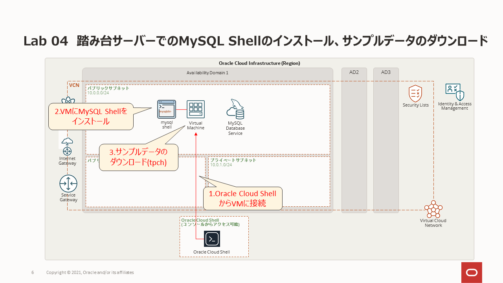

## 手順

### **Step 4.1:**
- 画面左上のメニューから _**コンピュート >> インスタンス**_ を選択します。
 作成済のインスタンスをクリックして _**パブリックIPアドレス**_ をコピーします。

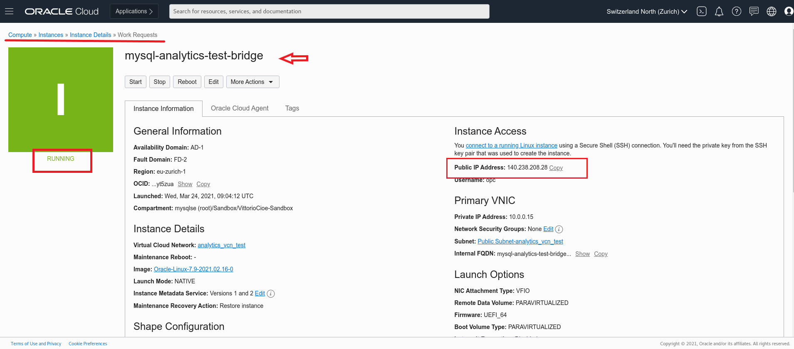

### **Step 4.2:**
- 踏み台サーバーに接続するためにOCIコンソールに付属しているLinuxターミナルであるCloud Shellを利用します。
　Cloud Shellにアクセスするために, 画面右上に表示されているOCIリージョンの右側に表示されているCloud Shellアイコンをクリックします。
 
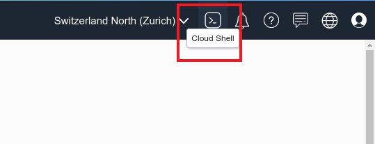

### **Step 4.3:**
- Cloud Shellを起動すると、下記画面例のようなターミナルが表示されます。
  

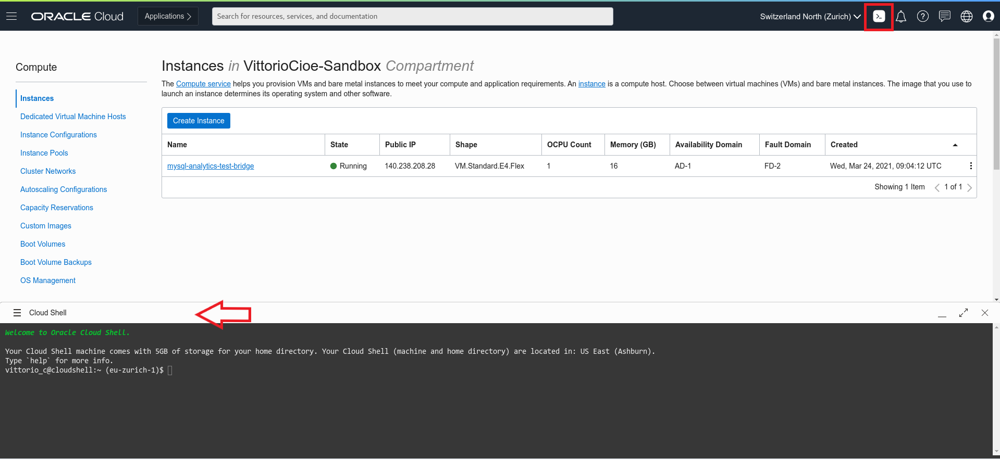

### **Step 4.4**
- 操作しやすくする為に、ここでフォントサイズを変更することを推奨します。
  

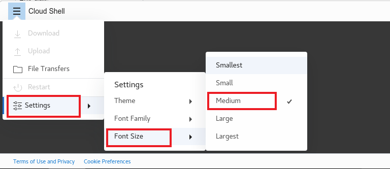

### **Step 4.5:**
- Cloud Shellウィンドウの右上隅には、[最小化]、[最大化]、[終了]ボタンがあります。 クラウドシェルを最大化すると、ページ全体のサイズになります。 OCIコンソールのページを移動する前に、サイズを元に戻すか最小化することを忘れないでください。

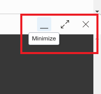

### **Step 4.6:**
- 保存してある秘密キーをCloud Shellウィンドウにドラッグ・アンド・ドロップします。_**ll**_ コマンドでファイル名を取得します。
- もしくはCloud Shellウィンドウ左上のメニューから _**アップロード**_ を選択し、秘密キーのファイルをアップロードします。
  

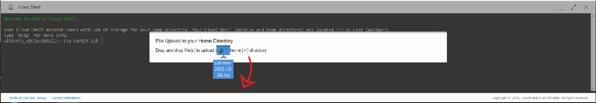

### **Step 4.7:**
- パブリックIPアドレスを用いて踏み台サーバーにSSH接続を行うため、以下のコマンドを実行します。
```
chmod 600 <private-key-file-name>.key
ssh -i <private-key-file-name>.key opc@<compute_instance_public_ip>
```

フィンガープリントを受け入れるかどうか確認されたら、 _**yes**_ と入力し、Enterキーを押すと以下の様な警告が表示されます。

_**Warning: Permanently added '130.******' (ECDSA) to the list of known hosts.**_

ここまでの操作でインスタンスに接続できるようになりました。

### **Step 4.8:**
- 次のコマンドを実行してMySQL ShellとMySQLクライアントをインストールします。 
  
```
wget https://dev.mysql.com/get/mysql80-community-release-el8-4.noarch.rpm
```
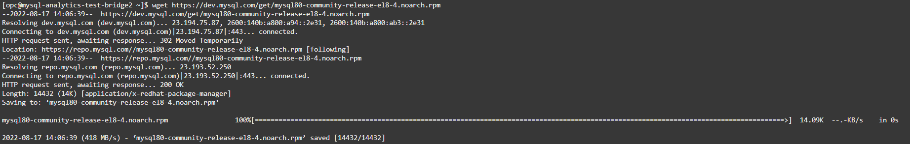
```
sudo yum localinstall mysql80-community-release-el8-4.noarch.rpm
```
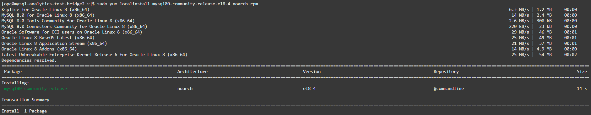

_**確認メッセージが表示された場合は "y"を入力します**_ 

```
sudo yum module disable mysql
```
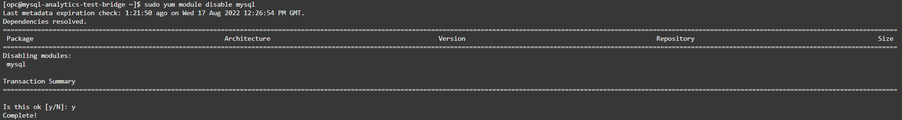

_**確認メッセージが表示された場合は "y"を入力します**_ 

```
sudo yum install mysql-shell  
```
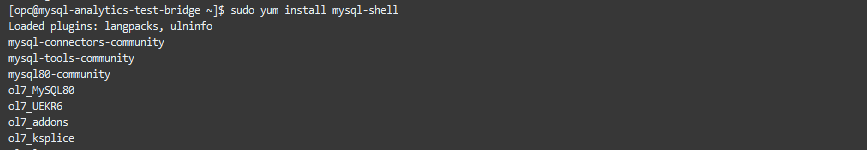

_**確認メッセージが表示された場合は "y"を入力します**_

```
sudo yum install mysql-community-client
```

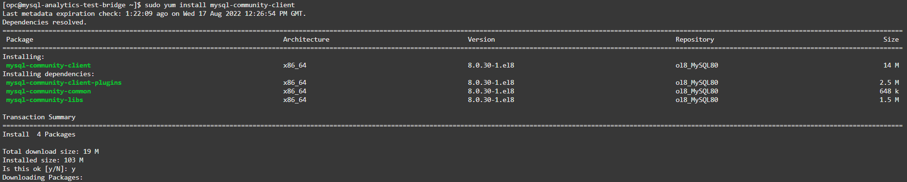

_**確認メッセージが表示された場合は "y"を入力します**_


### **Step 4.9:**
- 以下のコマンドを実行し、MySQL Shellを起動します。
```
mysqlsh
```
MySQL Shellプロンプトが表示されたら、以下のコマンドを実行して終了します。
```
\q
```

### **Step 4.10:**
- 以下のコマンドを実行して、演習用資材をダウンロード、解凍します。
```
cd /home/opc
```

```
wget https://objectstorage.ap-osaka-1.oraclecloud.com/p/seAq8Kgd4TyUqlv5M5qObMJwvsluhCPyOuHOn1L_t4HQYUle2DV-KdFeK44MS7yQ/n/idazzjlcjqzj/b/workshop/o/heatwave_workshop.zip

```

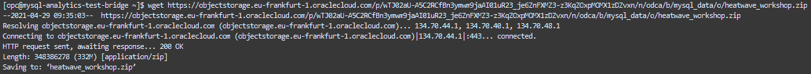

```
unzip heatwave_workshop.zip
```

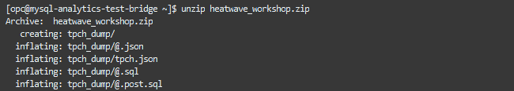


解凍できたら次の手順に進みます。

### **Step 4.11:**
- _**ll**_ コマンドを実行して展開された資材に以下のファイルが含まれていることを確認します。

_**tpch_dump**_

_**tpch_offload.sql**_

_**tpch_queries_mysql.sql**_

_**tpch_queries_rapid.sql**_

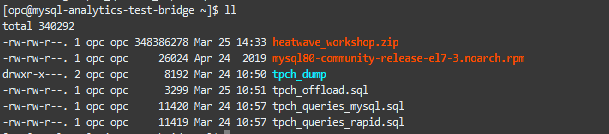


## まとめ

ここまでの操作で、Cloud Shellの起動、コンピュート・インスタンスに接続するための秘密キーをインポートしました。 更に、MySQL ShellとMySQLクライアントをインストールし、最後に後でベンチマークに使用する資材をダウンロードして解凍しました。

**[<< Lab 03](/Lab03/README.md)** | **[Home](../README.md)** | **[Lab 05 >>](/Lab05/README.md)**
