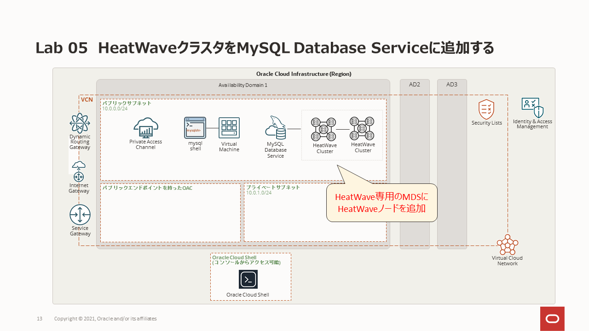
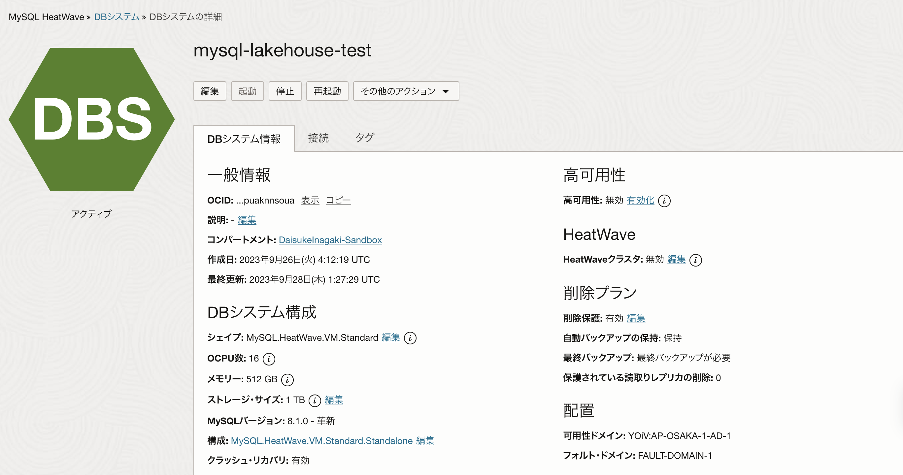
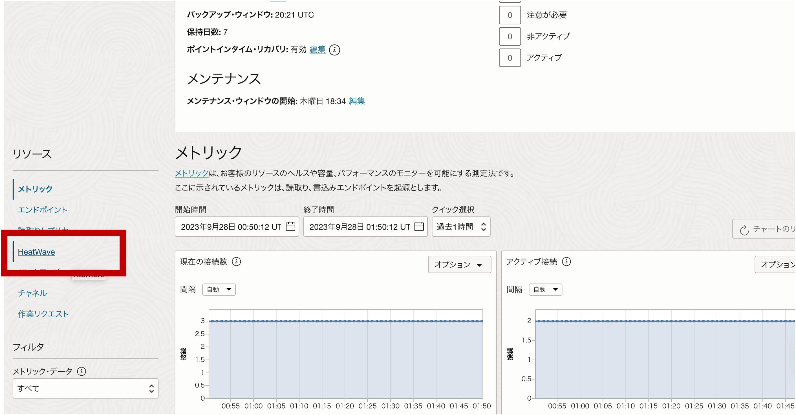
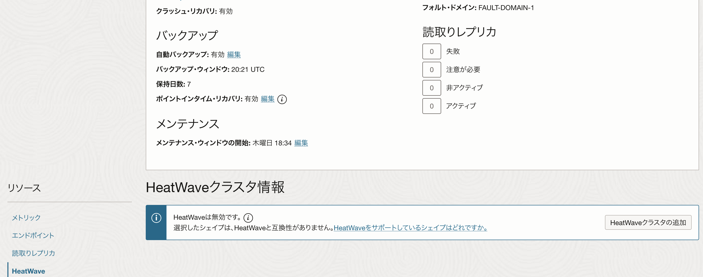
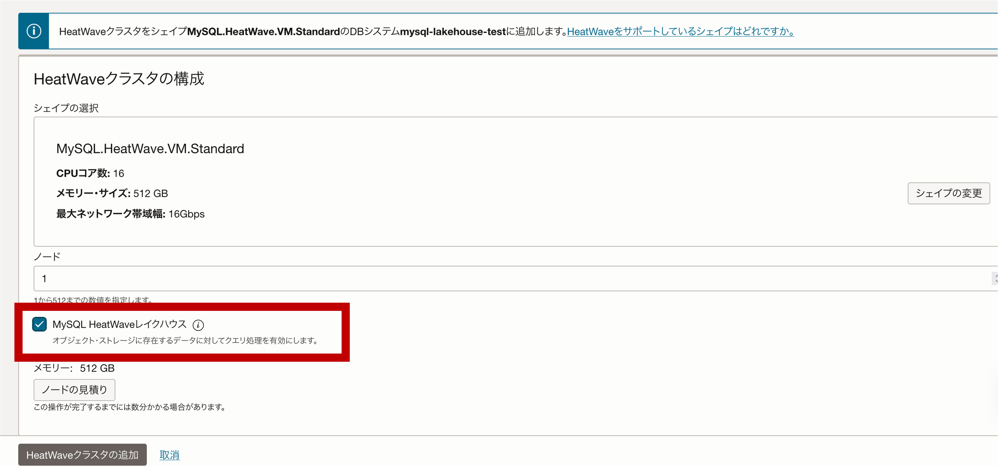
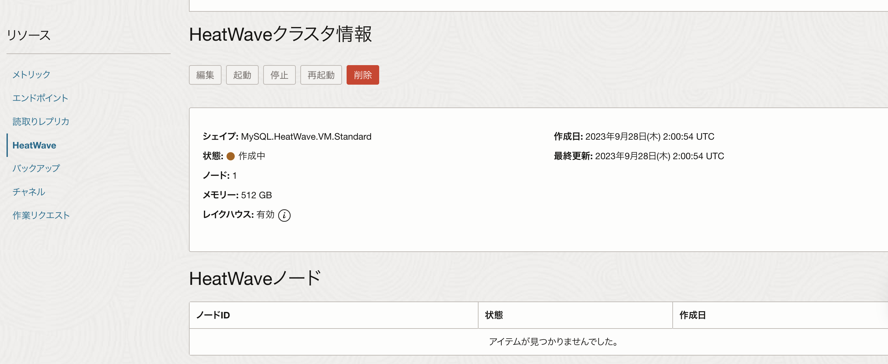
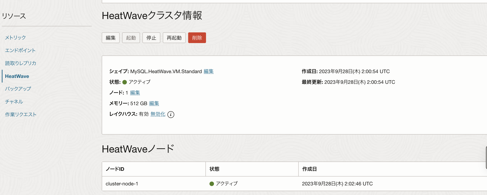

# Lab 05: HeatWaveクラスタをMySQL Database Serviceに追加する

## 学べること
- HeatWaveクラスタを有効にする方法

## 概要

HeatWaveを選択すると、分析クエリの処理を高速化するためのHeatWaveクラスターのプロビジョニングが可能になります。 HeatWaveクラスターは、MySQL DBシステムノードと2つ以上のHeatWaveノードで構成されます。 MySQL DBシステムノードには、クラスタ管理、クエリスケジューリング、およびクエリ結果のMySQL DBシステムへの応答を担当するHeatWaveプラグインが含まれています。 HeatWaveノードはデータをメモリに保存し、クエリを処理します。

HeatWaveクラスターを有効にすると、特定の条件を満たすクエリがMySQL DBシステムからHeatWaveクラスターに自動的にオフロードされ、クエリ処理が高速化されます。クエリは、MySQL　DBシステムノードに接続することでHeatWaveクラスターと対話するMySQLクライアントまたはアプリケーションから発行されます。結果は、MySQL DBシステムノードと、クエリを発行したMySQLクライアントまたはアプリケーションに返却されます。
HeatWaveクラスターをデプロイした後、データをロードしてクエリを実行する方法については、**[HeatWaveユーザーガイド](https://dev.mysql.com/doc/heatwave/en/)** を参照してください。

## このステップの構成図

## 手順

### **Step 5.1:**
- 画面左上のメニューから _**データベース >> DBシステム**_ を選択します。
DBシステム一覧から先に作成したインスタンスをクリックして _**アクティブ**_ の状態となっていることを確認します。
表示されている _**プライベートIPアドレス**_ を控えておきます。

### **Step 5.2:**
- 画面下部にスクロールして左側に表示されているメニューから _**HeatWave**_ を選択します。
  

### **Step 5.3:**
- _**HeatWaveクラスタの追加**_ ボタンをクリックします。
  

### **Step 5.4:**
- 下図のようにシェイプが選択され、ノード数が 1 に設定されていることを確認します。
_**HeatWaveクラスタの追加**_ ボタンをクリックします。

### **Step 5.5:**
- メインページに戻り、作成状況を確認できます。 数秒後にノードが _**作成中**_ のステータスになっているはずです。
  

### **Step 5.6:**
- 完了すると _**アクティブ**_ のステータスになります。 この処理には少し時間がかかります。 
  

## まとめ

これで、MySQL DBシステムノードと2つのHeatWaveノードで構成されるHeatWaveクラスタを追加できました! 
MySQL DBシステムノードには、クラスタ管理、クエリスケジューリング、およびクエリ結果をMySQL DBシステムへ返却するHeatWaveプラグインが含まれています。HeatWaveノードはデータをメモリに保存し、クエリを処理します。
**[Oracle Cloud上のHeatWaveサービス](https://docs.oracle.com/ja-jp/iaas/mysql-database/doc/heatwave.html)**
それではHeatWaveクラスタを有効にする前に、次の演習ではMySQL DBシステムでクエリを実行してみましょう。

**[<< Lab 04](/Lab04/README.md)** | **[Home](../README.md)** | **[Lab 06 >>](/Lab06/README.md)**
