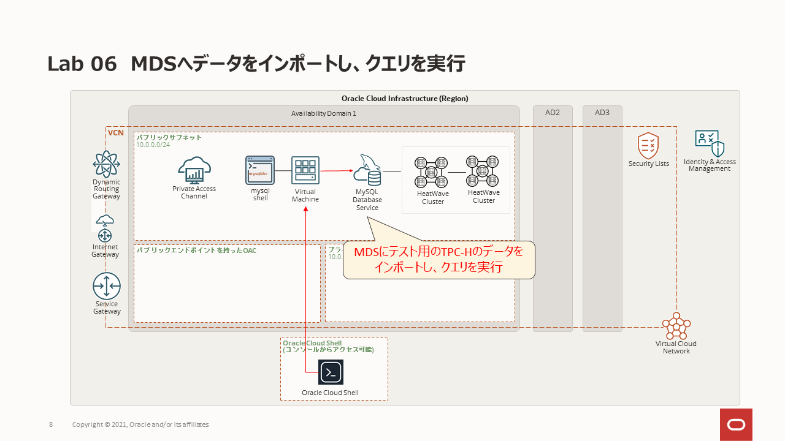

# Lab 06: MDSへデータをインポートし、クエリを実行

## 学べること
- MDSに接続し、データを格納する方法

## このステップの構成図


## 手順

### **Step 6.1:**
- Cloud ShellのSSH接続に戻ります。


- 以下のコマンドを実行してMySQL Shellを使用してMDSに接続します。
```
mysqlsh --user=admin --password=Oracle.123 --host=<mysql_private_ip_address> --port=3306 --js
```

### **Step 6.2:**
- MySQL ShellプロンプトでMDSにデータが格納できるか確認します。
```
util.loadDump("/home/opc/tpch_dump", {dryRun: true, resetProgress:true, ignoreVersion:true})
```


上記のコマンドは予行演習オプション(dryRun: true)が指定されていおり、実行時に何もエラーが発生しなければ次のコマンドを実行してデータを格納します。
```
util.loadDump("/home/opc/tpch_dump", {dryRun: false, resetProgress:true, ignoreVersion:true})
```


### **Step 6.3:**
- MySQL Shellで以下のコマンドを実行してデータが格納されたことを確認します。

```
\sql

SHOW DATABASES;
```
(実行結果)
```
+--------------------+
| Database           |
+--------------------+
| information_schema |
| mysql              |
| performance_schema |
| sys                |
| tpch               |
+--------------------+
```
続いて、以下のコマンドを実行します。
```
USE tpch;

SHOW TABLES;
```
(実行結果)
```
+----------------+
| Tables_in_tpch |
+----------------+
| customer       |
| lineitem       |
| nation         |
| orders         |
| part           |
| partsupp       |
| region         |
| supplier       |
+----------------+
```

### **Step 6.4:**
- それでは、クエリを実行してみましょう。 
同じプロンプトで以下のSQLの実行時間を確認します。(約12-13秒):
```
SELECT
    l_returnflag,
    l_linestatus,
    SUM(l_quantity) AS sum_qty,
    SUM(l_extendedprice) AS sum_base_price,
    SUM(l_extendedprice * (1 - l_discount)) AS sum_disc_price,
    SUM(l_extendedprice * (1 - l_discount) * (1 + l_tax)) AS sum_charge,
    AVG(l_quantity) AS avg_qty,
    AVG(l_extendedprice) AS avg_price,
    AVG(l_discount) AS avg_disc,
    COUNT(*) AS count_order
FROM
    lineitem
WHERE
    l_shipdate <= DATE '1998-12-01' - INTERVAL '90' DAY
GROUP BY l_returnflag , l_linestatus
ORDER BY l_returnflag , l_linestatus;
```
```
+--------------+--------------+-------------+-----------------+-------------------+---------------------+-----------+--------------+----------+-------------+
| l_returnflag | l_linestatus | sum_qty     | sum_base_price  | sum_disc_price    | sum_charge          | avg_qty   | avg_price    | avg_disc | count_order |
+--------------+--------------+-------------+-----------------+-------------------+---------------------+-----------+--------------+----------+-------------+
| A            | F            | 37734107.00 |  56586554400.73 |  53758257134.8700 |  55909065222.827692 | 25.522006 | 38273.129735 | 0.049985 |     1478493 |
| N            | F            |   991417.00 |   1487504710.38 |   1413082168.0541 |   1469649223.194375 | 25.516472 | 38284.467761 | 0.050093 |       38854 |
| N            | O            | 74476040.00 | 111701729697.74 | 106118230307.6056 | 110367043872.497010 | 25.502227 | 38249.117989 | 0.049997 |     2920374 |
| R            | F            | 37719753.00 |  56568041380.90 |  53741292684.6040 |  55889619119.831932 | 25.505794 | 38250.854626 | 0.050009 |     1478870 |
+--------------+--------------+-------------+-----------------+-------------------+---------------------+-----------+--------------+----------+-------------+
4 rows in set (12.6570 sec)
```
- 以下のコマンドを実行して、MySQL Shellを終了します。
  
```
 \exit
```

## まとめ
次の演習でHeatwaveサービスを有効にしてクエリを再度実行し、結果を比較してみましょう！


**[<< Lab 05](/Lab05/README.md)** | **[Home](../README.md)** | **[Lab 07 >>](/Lab07/README.md)**
