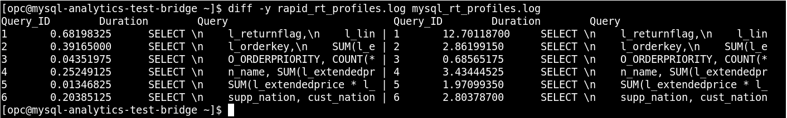

# Lab 07: HeatWaveを有効にしてクエリを実行する

## 学べること
- HeatWaveを有効にする方法を学び、HeatWaveが無効になっている場合とクエリ実行時間を比較する

## 概要

HeatWaveを利用する際にはクエリ実行する対象のテーブルをHeatWaveクラスタのメモリにロードする必要があります。</br>
HeatWaveクラスタのサイズは、ロードされたテーブルと列、およびこのデータのメモリで達成された圧縮によって異なります。HeatWaveクラスターのプロビジョニングが不十分な場合、スペースの制限により、データのロードまたはクエリの実行が失敗します。</br>
なおHeatWaveを有効化する際に、HeatWaveクラスタに必要なノード数の見積もりを行うと、ワークロードを実行するために推奨されるHeatWaveノード数が算出されます。 

## このステップの構成図


## 手順

### **Step 7.1:**
- OCIコンソールでHeatWaveノードが _**アクティブ**_ の状態になっていることを確認します。
  


### **Step 7.2:**
- HeatWaveノードが _**アクティブ**_ となっている場合は、以下のコマンドを実行してMySQL Shellを使用してMDSに接続します。

```
mysqlsh --user=admin --password=Oracle.123 --host=<mysql_private_ip_address> --port=3306 --sql
```

- 次に、以下のコマンドを実行してtpchデータベース内のテーブルをHeatWaveノードにロードします。

```
CALL sys.heatwave_load(JSON_ARRAY("tpch"),NULL);
\quit
```


 実行できたら _**Step 7.3**_ に進みます。

### **Step 7.3:**
- それでは、HeatWaveを使ってクエリを実行してみましょう。

MySQL Shellを利用してMDSに接続します。
```
mysqlsh --user=admin --password=Oracle.123 --host=<mysql_private_ip_address> --port=3306 --database=tpch --sql
```
- _**HeatWave**_ を有効にします。
```
set @@use_secondary_engine=ON;
```


- 実行計画(EXPLAIN)を確認し、セカンダリエンジンが有効になっていることを確認します。
```
EXPLAIN SELECT
    l_returnflag,
    l_linestatus,
    SUM(l_quantity) AS sum_qty,
    SUM(l_extendedprice) AS sum_base_price,
    SUM(l_extendedprice * (1 - l_discount)) AS sum_disc_price,
    SUM(l_extendedprice * (1 - l_discount) * (1 + l_tax)) AS sum_charge,
    AVG(l_quantity) AS avg_qty,
    AVG(l_extendedprice) AS avg_price,
    AVG(l_discount) AS avg_disc,
    COUNT(*) AS count_order
FROM
    lineitem
WHERE
    l_shipdate <= DATE '1998-12-01' - INTERVAL '90' DAY
GROUP BY l_returnflag , l_linestatus
ORDER BY l_returnflag , l_linestatus;
```
("Using secondary engine RAPID" というメッセージが出力されます)

```
+----+-------------+----------+------------+------+---------------+------+---------+------+---------+----------+----------------------------------------------------------------------------+
| id | select_type | table    | partitions | type | possible_keys | key  | key_len | ref  | rows    | filtered | Extra                                                                      |
+----+-------------+----------+------------+------+---------------+------+---------+------+---------+----------+----------------------------------------------------------------------------+
|  1 | SIMPLE      | lineitem | NULL       | ALL  | NULL          | NULL | NULL    | NULL | 5970493 |    33.33 | Using where; Using temporary; Using filesort; Using secondary engine RAPID |
+----+-------------+----------+------------+------+---------------+------+---------+------+---------+----------+----------------------------------------------------------------------------+
1 row in set, 1 warning (0.0123 sec)
```

- もう一度先ほどのSQLを実行して実行結果を確認してみましょう。
```
SELECT
    l_returnflag,
    l_linestatus,
    SUM(l_quantity) AS sum_qty,
    SUM(l_extendedprice) AS sum_base_price,
    SUM(l_extendedprice * (1 - l_discount)) AS sum_disc_price,
    SUM(l_extendedprice * (1 - l_discount) * (1 + l_tax)) AS sum_charge,
    AVG(l_quantity) AS avg_qty,
    AVG(l_extendedprice) AS avg_price,
    AVG(l_discount) AS avg_disc,
    COUNT(*) AS count_order
FROM
    lineitem
WHERE
    l_shipdate <= DATE '1998-12-01' - INTERVAL '90' DAY
GROUP BY l_returnflag , l_linestatus
ORDER BY l_returnflag , l_linestatus;
```

- 今回の実行時間は0.05-0.2秒程度になると思います。

```
+--------------+--------------+-------------+-----------------+-------------------+---------------------+-----------+--------------+----------+-------------+
| l_returnflag | l_linestatus | sum_qty     | sum_base_price  | sum_disc_price    | sum_charge          | avg_qty   | avg_price    | avg_disc | count_order |
+--------------+--------------+-------------+-----------------+-------------------+---------------------+-----------+--------------+----------+-------------+
| A            | F            | 37734107.00 |  56586554400.73 |  53758257134.8700 |  55909065222.827692 | 25.522005 | 38273.129734 | 0.049985 |     1478493 |
| N            | F            |   991417.00 |   1487504710.38 |   1413082168.0541 |   1469649223.194375 | 25.516471 | 38284.467760 | 0.050093 |       38854 |
| N            | O            | 74476040.00 | 111701729697.74 | 106118230307.6056 | 110367043872.497010 | 25.502226 | 38249.117988 | 0.049996 |     2920374 |
| R            | F            | 37719753.00 |  56568041380.90 |  53741292684.6040 |  55889619119.831932 | 25.505793 | 38250.854626 | 0.050009 |     1478870 |
+--------------+--------------+-------------+-----------------+-------------------+---------------------+-----------+--------------+----------+-------------+
4 rows in set (0.0820 sec)
```
- 以下のコマンドを実行してMySQL Shellを終了します。
  
```
 \exit
```
### **Step 7.4:**

HeatWaveがどのように機能し、パフォーマンスが向上するかを見てきました。次はバッチを利用してクエリ実行を試してみます。

スクリプトtpch_queries_mysql.sqlを実行して、HeatWaveを使用せずにいくつかのクエリを実行します。
次に、スクリプトtpch_queries_rapid.sqlを実行して、HeatWaveを使用して同じクエリを実行します。
最後に、結果を比較します。

この演習では、MySQL Shellの代わりに、MySQLクライアントを使用します。
次のコマンドを実行します。
```
mysql -h<mysql private ip address> -uadmin -pOracle.123 -Dtpch < tpch_queries_rapid.sql
```
```
mysql -h<mysql private ip address> -uadmin -pOracle.123 -Dtpch < tpch_queries_mysql.sql
```
以下のコマンドを実行して、HeatWaveを使用しない場合は完了までに時間がかかっていることが分かると思います。
```
diff -y rapid_rt_profiles.log mysql_rt_profiles.log
```

- 以下は出力結果のサンプルです。



- ここまで、HeatWave(RAPIDエンジン)、MDS(InnoDBエンジン)単体それぞれを使用した場合の実行時間を比較しました。

補足: inspect tpch_queries_mysql.sql と tpch_queries_rapid.sql の違いについてはviなどを利用して確認してみてください。


## まとめ

クエリ実行時間を見てみると、HeatWaveクラスタが有効になっている場合、1秒以内にクエリ結果が返却されました。特定の条件を満たすクエリは、実行を加速するためにMySQL DBシステムからHeatWaveクラスタに自動的にオフロードされます。 クエリは、HeatWaveクラスタが有効になっているMDS経由でMySQLクライアントまたはアプリケーションから発行されます。 結果は、経由でクエリを発行したMySQLクライアントまたはアプリケーションに返却されます。


## 全て完了です！Well Done!

HeatWaveとOracle Analytics Cloudを組み合わせて利用する演習や、踏み台サーバーではなくOracle Bastion Serviceを使用してMDSへ接続する方法、MDSの高可用性構成をプロビジョニングする方法を案内した3つのボーナストラックがあります！
引き続き演習を続けましょう。

**[<< Lab 06](/Lab06/README.md)** | **[Home](../README.md)** | **[Lab 08 >>](/Lab08/README.md)**
