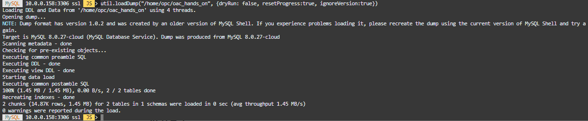

# Lab 08: OAC用のサンプルデータをMDS及びHeatWaveにロードする。Oracle Analytics Cloud(OAC) を構成して、OACからMDS for HeatWaveに接続する。

## 学べること:
- OAC用のサンプルデータのダウンロード、MDSおよびHeatWaveへサンプルデータをロードする方法
- Oracle Analytics Cloud(OAC)及びPrivate Access Channel(PAC)の構成方法
- OACからPAC経由でMDSへ接続する方法

## 概要

Oracle Analytics CloudはOCI上で利用できる高機能なBIサービスです。このLabでは、まずはOAC用のサンプルデータをダウンロードしてMDS及びHeatWaveにロードします。その後、OACを構成し、次にPrivate Access Channel(PAC)を構成します。PACを使うことで、OACからプライベートIPアドレスにアクセス可能になるため、HeatWave用のMDSに接続可能になります。

　※MDSはパブリックIPを持てない仕様になっているため、何らしかの手法でプライベートIPにアクセスする必要があります。
　　セキュリティの観点等から、PACを使ったアクセスを推奨しています。

## 前提条件

- Lab00～Lab05までを完了している必要があります。(Lab04aは除く) 

## このステップの構成図


## 手順

### **Step 8.1:**
- Cloud ShellのSSH接続に戻ります。


- 以下のコマンドを実行して、演習用資材をダウンロード、解凍します。
```
cd /home/opc
```

```
wget https://objectstorage.ap-osaka-1.oraclecloud.com/p/2b0vXZXLx4M4dBREKIAt77EpkGls9KqNb-YGBZg0r0EkDMd-5eL2MCNTHLEKP-Td/n/idazzjlcjqzj/b/workshop/o/oac_hands_on.zip

```


```
unzip oac_hands_on.zip
```


解凍できたら次の手順に進みます。

### **Step 8.2:**
- _**ll**_ コマンドを実行して展開された資材に以下のディレクトリ、ファイルが含まれていることを確認します。

_**check_heatwave.sql**_

_**dbuser01_offload.sql**_

_**oac_hands_on**_


### **Step 8.3:**
- 以下のコマンドを実行してMySQL Shellを使用してMDSに接続します。
```
mysqlsh --user=admin --password=Oracle.123 --host=<mysql_private_ip_address> --port=3306 --js
```

- - MySQL ShellプロンプトでMDSにデータが格納できるか確認します。
```
util.loadDump("/home/opc/oac_hands_on", {dryRun: true, resetProgress:true, ignoreVersion:true})
```


上記のコマンドは予行演習オプション(dryRun: true)が指定されていおり、実行時に何もエラーが発生しなければ次のコマンドを実行してデータを格納します。
```
util.loadDump("/home/opc/oac_hands_on", {dryRun: false, resetProgress:true, ignoreVersion:true})
```


### **Step 8.4:**
- MySQL Shellで以下のコマンドを実行してデータが格納されたことを確認します。

```
\sql

SHOW DATABASES;
```
(実行結果)
```
+--------------------+
| Database           |
+--------------------+
| dbuser01           |
| information_schema |
| mysql              |
| performance_schema |
| sys                |
| tpch               |
+--------------------+
```
続いて、以下のコマンドを実行します。
```
USE dbuser01;

SHOW TABLES;
```
(実行結果)
```
+--------------------+
| Tables_in_dbuser01 |
+--------------------+
| CUSTOMER           |
| RFM                |
+--------------------+
```

### **Step 8.5:**
- MySQL Shellで以下のコマンドを実行してdbuser01データベース内のテーブルをHeatWaveにロードします。

```
CALL sys.heatwave_load (JSON_ARRAY("dbuser01"),NULL);
```


### **Step 8.6:**

- 画面左上のメニューから  _**アナリティクスとAI -> アナリティクス・クラウド**_ を選択します。
  


### **Step 8.7:**
_**インスタンスの作成**_ をクリックして表示されたウインドウで、名前に _**OACDemo**_ と入力し、容量を _**2 OCPU**_ にします。また、機能セットが _**Enterprise Analytics**_ 、ライセンス・タイプが _**ライセンス込み**_ であることを確認して、 _**作成**_ をクリックします。
_**Note:**_ インスタンスの作成には _**15-20 分程度**_ かかります。


### **Step 8.8:**
ステータスが _**ACTIVE**_ になったら、左下の _**プライベート・アクセス・チャネル**_ をクリックし、 _**プライベート・アクセス・チャネルの構成**_ をクリックします。


### **Step 8.9:**
表示されたウインドウで、名前に _**PrivateChannel**_ 、仮想クラウド・ネットワークを _**analytics_vcn_test**_ 、サブネットを _**パブリック・サブネット-analytics_vcn_test**_ にします。

また、DNSゾーンの _**DNSゾーンとしての仮想クラウド・ネットワークのドメイン名(analyticsvcntes.oraclevcn.com)**_ にチェックを入れます。そして、追加で表示されたDNSゾーンの入力行を右側の _**✕**_ をクリックして削除します。その後、 _**構成**_ をクリックしてプライベート・アクセス・チャネルを構成します。

_**Note:**_ プライベート・アクセス・チャネルの構成には _**40分-50分程度**_ かかります。 


### **Step 8.10:**
ステータスが _**ACTIVE**_ になったら、_**分析ホームページ**_ ボタンを押します。


### **Step 8.11:**
MySQL Database Serviceへの接続を作成します。右上の _**作成**_ をクリックし、_**接続**_ を選択します。


### **Step 8.12:**

接続タイプを選択する画面が表示されるので、 _**MySQL**_ を選択します。


表示されるウインドウに接続に必要な情報を入力します。接続名には _**HeatWave**_ を入力します。
また、ホスト名にはMDSの _**Internal FQDN**_ を入力する必要があることに注意して下さい。Internal FQDNを確認するためには、MDSの詳細ページを参照する必要があります。 


データベース名には _**dbuser01**_ を入力して下さい。また、ユーザー名、パスワードはMDS作成時に指定したものを入力して下さい。

```
username: admin
password: Oracle.123
```
必須項目を入力し終わったら、 _**保存**_ をクリックします。


接続が正常に作成出来れば、Oracle Analytics Cloud から MySQL Database Service for Heatwawe接続してデータを参照できるようになります。

この後のOACのハンズオン手順は、[こちら](https://objectstorage.ap-osaka-1.oraclecloud.com/p/lUQ4xrSZputspcfF9LGd21C3ey62MPA4KVBGNdalPEGA7aB2jgdY4XZ4MyIoMA9e/n/idazzjlcjqzj/b/workshop/o/OAC%E4%BD%93%E9%A8%93%E3%83%8F%E3%83%B3%E3%82%BA%E3%82%AA%E3%83%B3.zip)の資料で説明します。また、[こちら](https://videohub.oracle.com/channel/Oracle+Japan+Analyitcs+Channel/228666053)の動画でもハンズオン手順を案内していますが、この動画ではDBにHeatWaveではなく、Oracle Autonomous Data Warehouse(ADW)を使用していることに注意して下さい。


### **備考:**

・OACからのアクセスでHeatWaveが使えているかどうかは、ステータス変数 _**rapid_query_offload_count**_ の値が増加するかどうかで確認できます。確認する時は、 MySQL ShellでMDSに接続し、SQLモードにした状態で以下のコマンドを実行します。

```
SHOW STATUS LIKE 'rapid_query_offload_count';
```

・OACからのアクセスで思うようにパフォーマンスが出ず、 _**rapid_query_offload_count**_ の値も増加しない場合は、HeatWaveが正しく使えていない可能性がありますので、MySQLお問い合わせ窓口(MySQL-Sales_jp_grp@oracle.com)までお問い合わせ下さい。なお、HeatWaveでは一部対応できていないデータ型、関数などがあります。現在のHeatWaveの制限事項については、[こちら](https://dev.mysql.com/doc/heatwave/en/heatwave-limitations.html)のドキュメントを参照して下さい。(HeatWaveのバージョンが上がる毎に、制限事項は減りつつあります)

**[<< Lab 07](/Lab07/README.md)** | **[Home](../README.md)** | **[Lab 09 >>](/Lab09/README.md)**