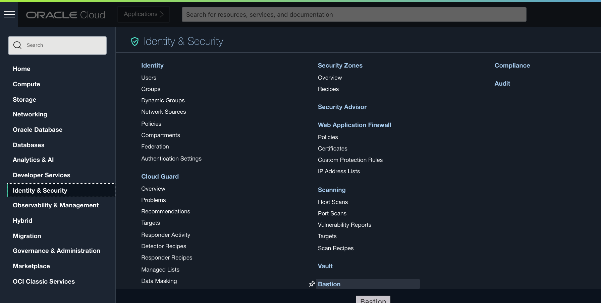
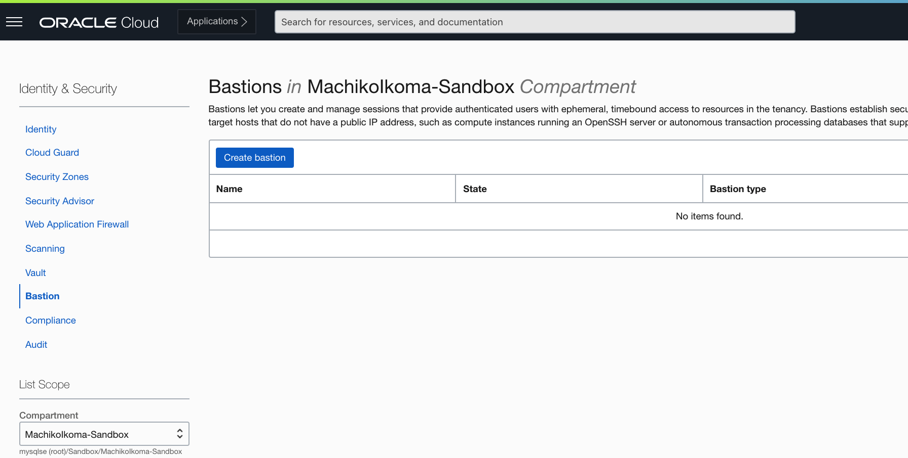
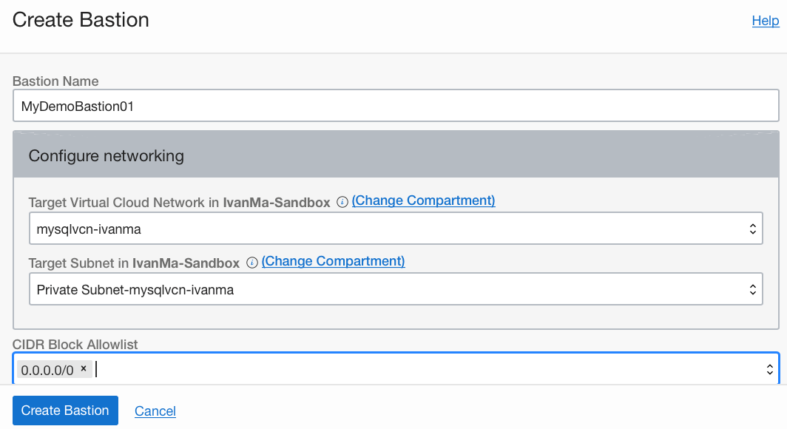
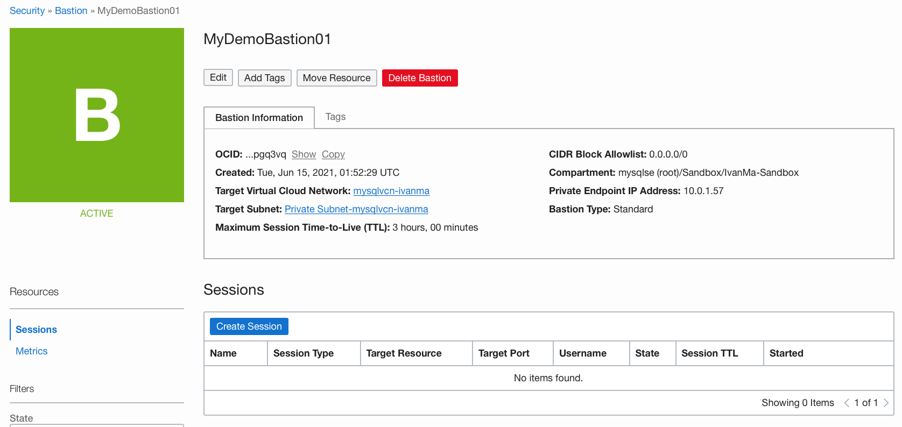
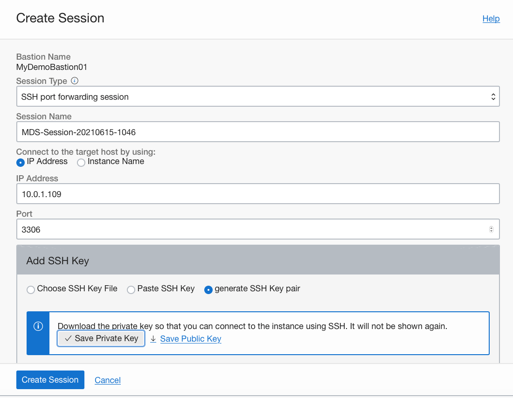
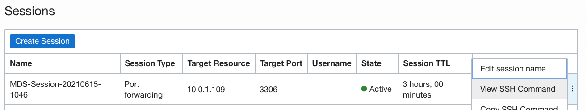
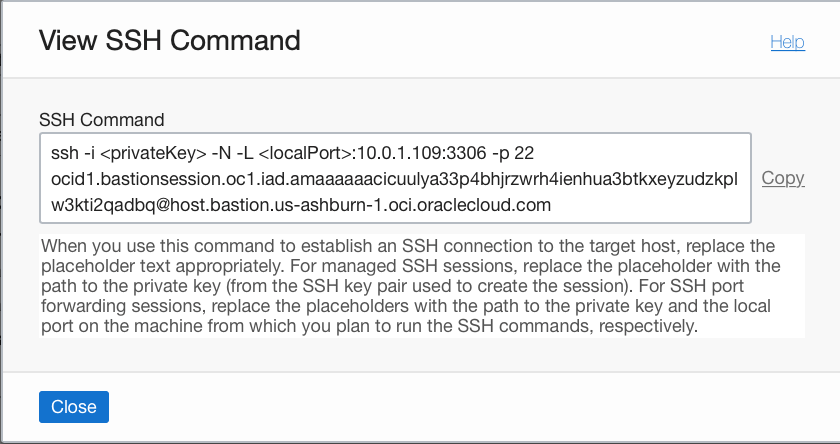
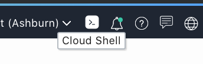
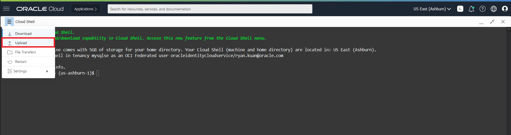
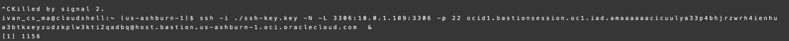

# Lab 09: OCI Bastion Serviceを利用してMDSをリモートで使う

## 学べること

- リモートでMDSを管理するためのOCI Bastion Serviceの構築方法 

## 概要

Oracle Cloud Infrastructure（OCI）Bastion Serviceは、パブリックエンドポイントを持たないターゲットリソースへの制限付きアクセスを提供します。 OCI Bastion Srviceを使用すると、次のことができます
Bastionコンピュート・インスタンスを使用せずに、安全な接続を介してMDSインスタンスをリモートで管理、および接続する。

OCI Bastion Serviceについては、**[OCI Bastion Service](https://docs.oracle.com/ja-jp/iaas/Content/Bastion/Concepts/bastionoverview.htm)** をご参照ください。

## 手順

### **Step 1.1:**
  OCIコンソール画面左上のメニューから _**Identity & Security >> 要塞**_ を選択します。



### **Step 1.2:**
 左側のコンパートメントが正しく選択されていることを確認し、_**要塞の作成**_ をクリックします。



### **Step 1.3:** 
Fill in the details of the following fields:
 * _**要塞名**_: Bastionサービス名を入力します。
 * _**ターゲット仮想クラウド・ネットワーク**_: 仮想クラウド・ネットワークを選択します。
 * _**ターゲット・サブネット**_: MDSインスタンスを作成したサブネットを選択します。
 * _**CIDRブロック許可リスト**_: 接続元のIPアドレスを指定します。(もし不明であれば、0.0.0.0/0をテスト用に指定します)

_**要塞の作成**_ をクリックしてBastion Serviceを開始します。



### **Step 1.4:** 
Bastion Serviceが開始されたら_**セッションの作成**_ をクリックします。

 

### **Step 1.5:**
Fill in the details of the following fields:
 * _**セッション・タイプ**_: _**SSHポート転送セッション**_ をドロップダウンリストから選択します。
 * _**セッション名**_: Bastionセッションに対する名前を入力します。
 * _**ターゲット・ホストへの接続方法**_: select _**IPアドレス**_　を選択します。
 * _**IPアドレス**_: MDSインスタンスのIPアドレスを指定します。
 * _**ポート**_: 3306 (MDSのデフォルトのポート番号)を指定します。
 * _**SSHキーの追加**_: _**SSHキー・ペアの作成**_ を選択し、and click on _**秘密キーの保存**_ をクリックします。(必要に応じて公開キーも保存してください)

_**セッションの作成**_ をクリックします。



## Bastion service経由でMDSに接続する

### Step 1.1: 

作成したBastion Serviceの一番右のメニューから_**SSHコマンドの参照**_ を選択します。



## Step 1.2:

_**コピー**_ をクリックしてSSHコマンドをコピーします。



## Step 1.3:

 Cloud Shell上で、Bastion serviceを経由してMDSへの接続を行います。



## Step 1.4:

ダウンロードした秘密キー(例えば、private-key.pem)をCloud Shellにアップロードしてホームディレクトリに保存します。



## Step 1.5:

SSHコマンドをCloud Shellにペーストし, 秘密キーのファイルパス、ポート番号(3306)を指定します。次に、MySQLクライアントを使用してMDSに接続します。

```
ssh -i ~/private-key.pem -N -L 3306:10.0.1.109:3306 -p 22 ocid.really.long.id &
mysql -uadmin -h127.0.0.1 -P3306 -pPassword
```



## まとめ

Bastion用のコンピュート・インスタンスを作成せずに、MDSインスタンスに接続するOCI Bastion Serviceを作成する方法を学習しました。 次の演習では、MDSの高可用性構成を作成してみます。

**[<< Lab 08](/Lab08/README.md)** | **[Home](../README.md)** | **[Lab 10 >>](/Lab10/README.md)**
